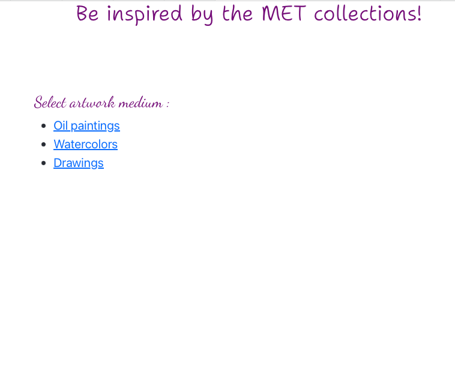
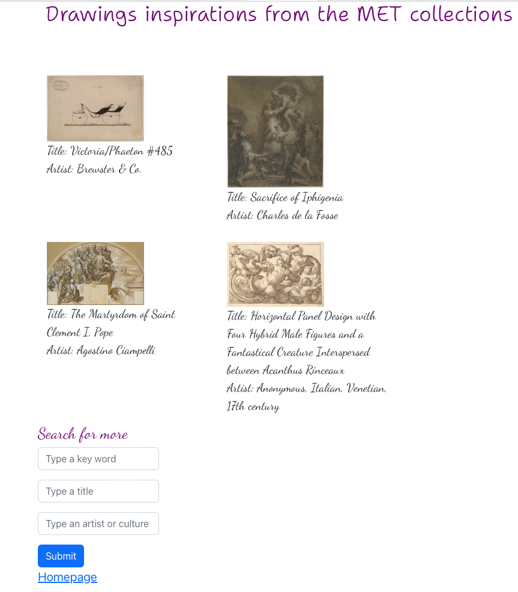
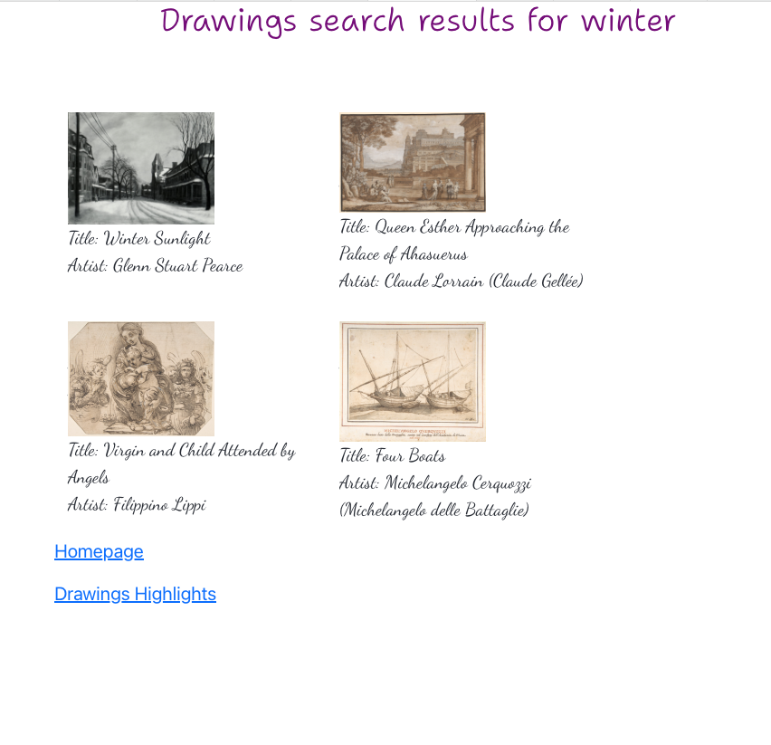

### Project overview

**Art** is my passion and painting is my hobby, however from time to time I am struggling to find my inspiration. Google and Pinterest make it sometimes much harder to find a good artwork example to get some ideas from. 

So I came up with creating an artwork discovery website to be able to view art collections and filter out examples from **the Metropolitan Museum of Art**.

The project has:
* The main page with several mediums (oils, watercolor, drawings).

* The highlights page with several artworks made with the medium selected, and options for filtering.

* Search results page.

### Requirements

 - The project is a React application, bootstrapped with `create-react-app`
 - The React app is deployed with AWS Amplify onto a web server and publicly accessible https://art-demo.dzxsr30hnxwpv.amplifyapp.com
- For this project I am calling *the Metropolitan Museum of Art Collection API* https://github.com/metmuseum/openaccess . There are API endpoints available for the following elements:
    - *Objects*: A listing of all valid Object IDs available for access.
    - *Object*: A record for an object, containing all open access data about that object, including its image (if the image is available under Open Access)
    - *Departments*: A listing of all valid departments, with their department ID and the department display name
    - *Search*: A listing of all Object IDs for objects that contain the search query within the object’s data

### Challenges

1. To get Highlights (inspirations) there is the only option to use search with some parameters. I decided to create a JSON file with a list of common words and within each medium search for a random word from that collection.

2. I uncovered some inconsistency in the **API behavior**:
 - some ids returned by search can not be found by object API; 
 - some objects do not have images;
 - in rare cases image URL returns ‘not found’. 
 
To overcome this I introduced additional logic: I am trying to get more objects then I need and I filter out invalid ones.

### What to improve

* CSS. 
* Routing when search.
